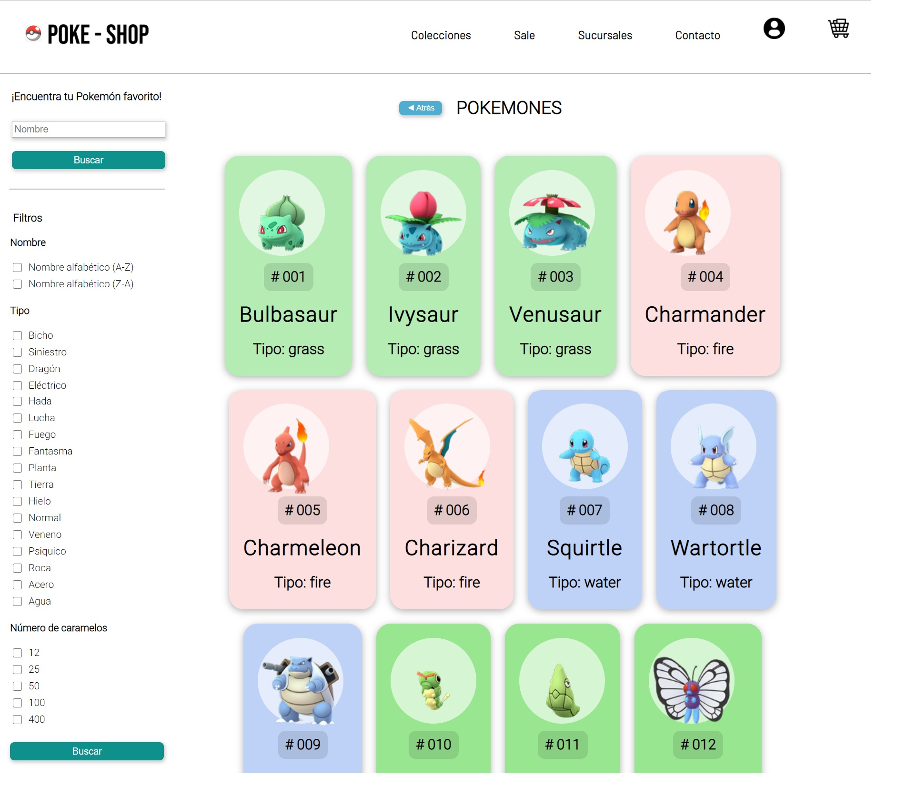
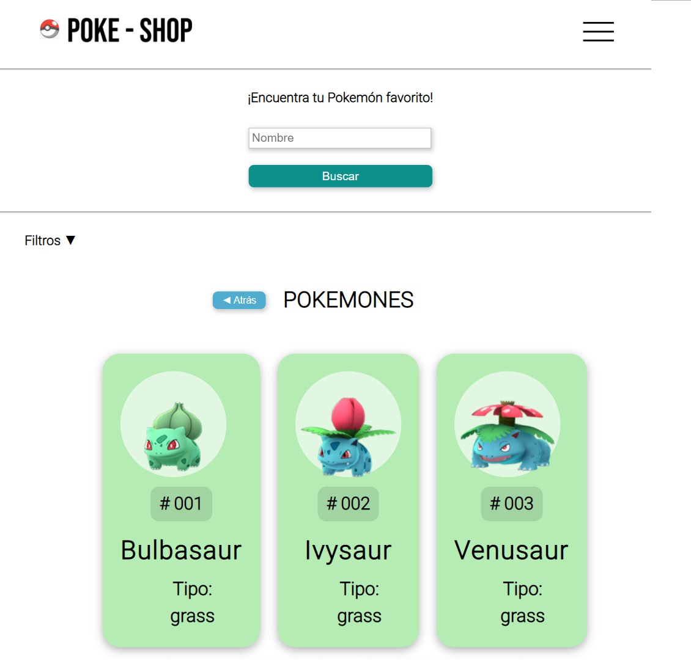

# Data Lovers

Plataforma Web de visualización y filtrado de información.

## El Proyecto

Se buscar crear una plataforma Web amigable e intuitiva que permita visualizar y filtrar la información en base a las necesidades del usuario.

**Duración:** 3 semanas.
**Métodos:** Investigación, Ideación, Wireframes, Prototipado, Creación y Testeo.
**Herramientas:** 

## Contexto

Pensando en todos los usuarios de Pokemón Go que les gusta capturar a los personajes para poder competir en torneos o simplemente coleccionarlos, se creó **POKE-SHOP** una plataforma Web / Móvil amistosa que permite a los usuarios adquirir el pokemón que deseen, sin importar el lugar o temporada en el que se encuentren.

Imagen: Plataforma Web.

Imagen: Dispositivo móvil.

## Proceso

## Usabilidad

